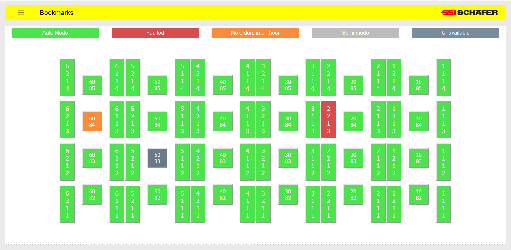
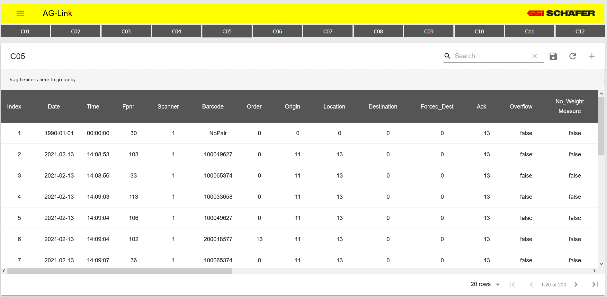
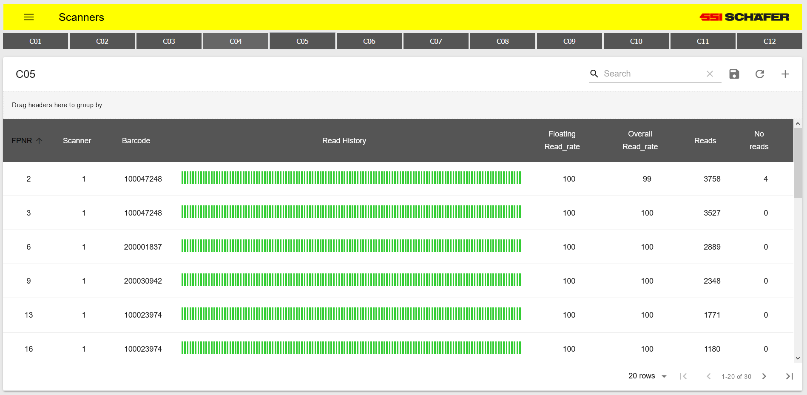
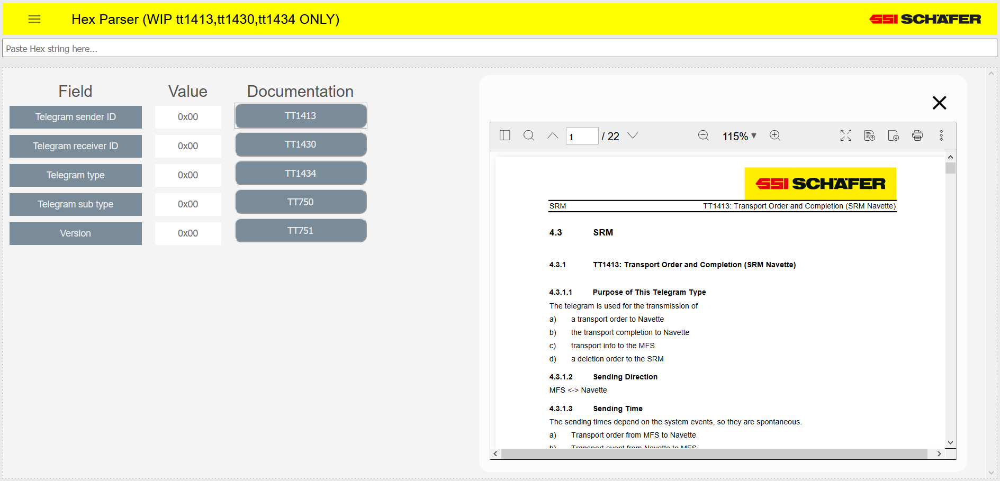
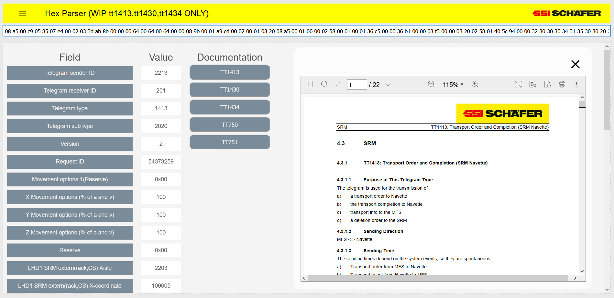

# PLC Toolkit

Custom user interface for reading data from Siemens S7 PLCs.

Built with react; bootstrapped with create-react-app.

Communications to PLC handled via [nodes7](https://github.com/plcpeople/nodeS7)

Built using

    pkg -version
    4.4.3

    npm -version
    6.14.10

## Screenshots

### Bookmarks

> Hyperlinks with status to web-interface of automatic storage and retrieval machines.

### AG-Link

>PLC Transport order information for totes in the warehouse.

### Scanners

>Scanner read rates and bar code information.

### Hex Parser

>Hex parsing tool with built in documentation.

